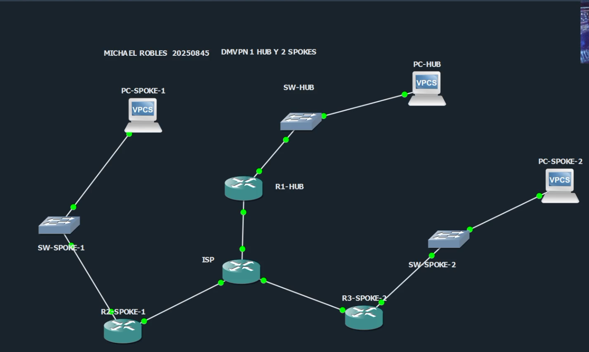
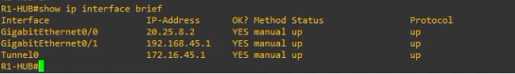
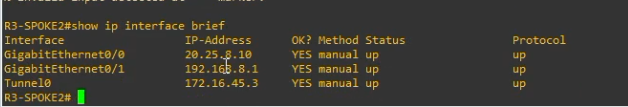
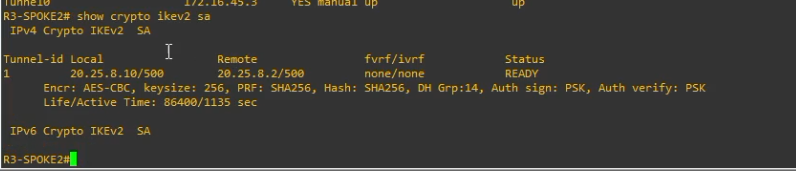
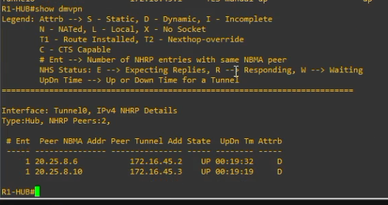
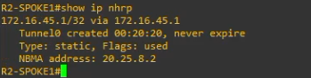
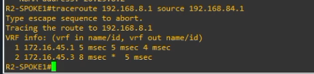
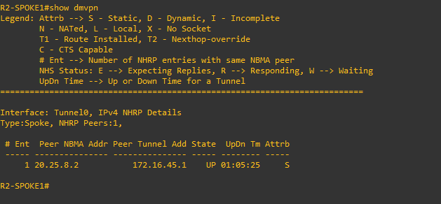

# DMVPN Hub and Spoke Fase 3 con IKEv2 y EIGRP


**Nombre:** Michael Robles  
**Matricula:** 20250845  
**Asignatura:** Seguridad de Redes  
**Practica:** VPN Hub and Spoke punto a multipunto DMVPN Fase 3 con IKEv2 y enrutamiento dinamico  
**Repositorio sugerido:** `https://github.com/iClexi/DMVPN-Hub-Spoke-IKEv2-Phase-3`  
**Video demostrativo:** https://youtu.be/p5YHZzax3G0

## Etiquetas

`DMVPN` `Phase-3` `IKEv2` `IPsec` `EIGRP` `GRE Multipoint` `NHRP` `Hub-and-Spoke` `GNS3` `Cisco`

---

## Indice

1. [Descripcion del proyecto](#descripcion-del-proyecto)
2. [Topologia](#topologia)
3. [Direccionamiento IP](#direccionamiento-ip)
4. [Parametros de la VPN](#parametros-de-la-vpn)
5. [Como funciona DMVPN Fase 3](#como-funciona-dmvpn-fase-3)
6. [Configuraciones](#configuraciones)
7. [Verificacion](#verificacion)
8. [Evidencias](#evidencias)
9. [Estructura del repositorio](#estructura-del-repositorio)
10. [Entregables](#entregables)
11. [Conclusion](#conclusion)

---

## Descripcion del proyecto

Este repositorio documenta la configuracion de una VPN **DMVPN Hub and Spoke Fase 3** usando **IKEv2**, **IPsec**, **GRE multipoint**, **NHRP** y **EIGRP** como protocolo de enrutamiento dinamico.

La practica conecta tres sedes: un router central **R1-HUB** y dos sucursales remotas **R2-SPOKE1** y **R3-SPOKE2**. Entre ellos existe un router **ISP**, que representa la red publica. El ISP solo tiene conectividad WAN y no conoce las redes LAN internas; las redes privadas viajan protegidas dentro de la nube DMVPN.

---

## Topologia



La topologia esta formada por:

| Dispositivo | Funcion |
|---|---|
| R1-HUB | Router central, servidor NHRP y punto principal de control DMVPN |
| R2-SPOKE1 | Sucursal remota 1 |
| R3-SPOKE2 | Sucursal remota 2 |
| ISP | Red publica simulada en GNS3 |
| SW-HUB | Switch de acceso para la LAN del HUB |
| SW-SPOKE-1 | Switch de acceso para la LAN del SPOKE1 |
| SW-SPOKE-2 | Switch de acceso para la LAN del SPOKE2 |
| PC-HUB | Host de prueba en la LAN del HUB |
| PC-SPOKE-1 | Host de prueba en la LAN del SPOKE1 |
| PC-SPOKE-2 | Host de prueba en la LAN del SPOKE2 |

---

## Direccionamiento IP

### Red WAN publica simulada

| Enlace | Dispositivo | Interfaz | IP | Gateway/Vecino |
|---|---|---|---|---|
| R1 - ISP | ISP | G0/0 | 20.25.8.1/30 | R1: 20.25.8.2 |
| R1 - ISP | R1-HUB | G0/0 | 20.25.8.2/30 | ISP: 20.25.8.1 |
| R2 - ISP | ISP | G0/1 | 20.25.8.5/30 | R2: 20.25.8.6 |
| R2 - ISP | R2-SPOKE1 | G0/0 | 20.25.8.6/30 | ISP: 20.25.8.5 |
| R3 - ISP | ISP | G0/2 | 20.25.8.9/30 | R3: 20.25.8.10 |
| R3 - ISP | R3-SPOKE2 | G0/0 | 20.25.8.10/30 | ISP: 20.25.8.9 |

### Red de tunel DMVPN

| Router | Tunnel0 |
|---|---|
| R1-HUB | 172.16.45.1/24 |
| R2-SPOKE1 | 172.16.45.2/24 |
| R3-SPOKE2 | 172.16.45.3/24 |

### Redes LAN

| Sede | Red | Gateway | Host de prueba |
|---|---|---|---|
| HUB | 192.168.45.0/24 | 192.168.45.1 | PC-HUB: 192.168.45.10 |
| SPOKE1 | 192.168.84.0/24 | 192.168.84.1 | PC-SPOKE-1: 192.168.84.10 |
| SPOKE2 | 192.168.8.0/24 | 192.168.8.1 | PC-SPOKE-2: 192.168.8.10 |

---

## Parametros de la VPN

| Parametro | Valor |
|---|---|
| Tipo de VPN | DMVPN Hub and Spoke multipunto |
| Fase | Fase 3 |
| Protocolo de tunel | GRE multipoint |
| Seguridad | IPsec |
| Negociacion | IKEv2 |
| Cifrado IKEv2 | AES-CBC-256 |
| Integridad IKEv2 | SHA-256 |
| Grupo Diffie-Hellman | Grupo 14 |
| Autenticacion | Pre-Shared Key |
| PSK | ITLA20250845 |
| Transform-set IPsec | ESP-AES 256 + ESP-SHA256-HMAC |
| Modo IPsec | Transport |
| NHRP Network ID | 45 |
| NHRP Authentication | DMVPN45 |
| Tunnel Key | 45 |
| MTU | 1400 |
| TCP MSS | 1360 |
| Routing dinamico | EIGRP AS 45 |

---

## Como funciona DMVPN Fase 3

DMVPN Fase 3 permite que varias sucursales se conecten de forma dinamica usando una sola nube multipunto. El HUB funciona como servidor de registro NHRP. Los SPOKES se registran contra el HUB y usan la nube DMVPN para aprender rutas y comunicarse con otras sedes.

La diferencia principal de Fase 3 esta en el mecanismo de **redirect** y **shortcut**. Al inicio, un spoke puede enviar trafico hacia otro spoke usando el HUB como camino inicial. Cuando el HUB detecta que el trafico realmente puede ir directo entre spokes, envia un mensaje de redireccion. Luego el spoke crea un shortcut directo hacia el otro spoke.

En esta practica:

- **R1-HUB** usa NHRP redirect.
- **R2-SPOKE1** y **R3-SPOKE2** usan NHRP shortcut.
- **IKEv2** negocia la seguridad.
- **IPsec** cifra el trafico.
- **EIGRP** anuncia dinamicamente las redes LAN.

---

## Configuraciones

Las configuraciones completas estan en la carpeta [`configs`](configs/):

| Dispositivo | Archivo |
|---|---|
| R1-HUB | [`configs/R1-HUB.cfg`](configs/R1-HUB.cfg) |
| R2-SPOKE1 | [`configs/R2-SPOKE1.cfg`](configs/R2-SPOKE1.cfg) |
| R3-SPOKE2 | [`configs/R3-SPOKE2.cfg`](configs/R3-SPOKE2.cfg) |
| ISP | [`configs/ISP.cfg`](configs/ISP.cfg) |
| VPCS | [`configs/VPCS.txt`](configs/VPCS.txt) |
| Switches | [`configs/SWITCHES.cfg`](configs/SWITCHES.cfg) |

---

## Verificacion

Para comprobar el funcionamiento de la VPN se utilizaron los siguientes comandos:

```cisco
show ip interface brief
show crypto ikev2 sa
show crypto ipsec sa
show dmvpn
show ip nhrp
show ip eigrp neighbors
show ip route eigrp
traceroute 192.168.8.1 source 192.168.84.1
```

La verificacion confirma:

1. Las interfaces fisicas y Tunnel0 estan arriba.
2. IKEv2 negocia correctamente y muestra estado READY.
3. DMVPN registra los spokes contra el HUB.
4. NHRP resuelve las direcciones de tunel y NBMA.
5. EIGRP aprende rutas dinamicamente entre las sedes.
6. El traceroute desde SPOKE1 hacia SPOKE2 demuestra comunicacion entre LANs remotas.

---

## Evidencias

### 1. Topologia del laboratorio


### 2. Interfaces activas en R1-HUB



### 3. Interfaces activas en R3-SPOKE2



### 4. IKEv2 activo en R3-SPOKE2



### 5. DMVPN en R1-HUB con dos peers registrados



### 6. NHRP en R2-SPOKE1 hacia el HUB



### 7. Traceroute de SPOKE1 hacia SPOKE2



### 8. DMVPN en R2-SPOKE1



---

## Estructura del repositorio

```text
DMVPN-Hub-Spoke-IKEv2-Phase-3/
├── README.md
├── configs/
│   ├── R1-HUB.cfg
│   ├── R2-SPOKE1.cfg
│   ├── R3-SPOKE2.cfg
│   ├── ISP.cfg
│   ├── SWITCHES.cfg
│   └── VPCS.txt
├── docs/
│   ├── Documentacion Tecnica Profesional.docx
│   └── Documentacion Tecnica Profesional.pdf
├── images/
│   ├── 01_topologia.png
│   ├── 02_r1_show_ip_interface_brief.png
│   ├── 03_r3_show_ip_interface_brief.png
│   ├── 04_r3_show_crypto_ikev2_sa.png
│   ├── 05_r1_show_dmvpn.png
│   ├── 06_r2_show_ip_nhrp.png
│   ├── 07_r2_traceroute_spoke_to_spoke.png
│   └── 08_r2_show_dmvpn.png
└── entregables/
    └── links_videos.txt
```

---

## Entregables

| Entregable | Estado |
|---|---|
| Configuraciones `.cfg` | Completado |
| Documentacion tecnica profesional en PDF | Completado |
| README tipo tutorial | Completado |
| Evidencias/capturas | Completado |
| Link del video | https://youtu.be/p5YHZzax3G0 |
| Link del repositorio | https://github.com/iClexi/DMVPN-Hub-Spoke-IKEv2-Phase-3 |

---

## Conclusion

La practica demuestra una VPN DMVPN Fase 3 funcional con IKEv2, IPsec y EIGRP. El HUB centraliza el registro NHRP y los spokes pueden comunicarse con otras sedes de forma dinamica. Las evidencias muestran interfaces activas, negociacion IKEv2 en estado READY, peers DMVPN registrados, resolucion NHRP y comunicacion entre LANs remotas.
